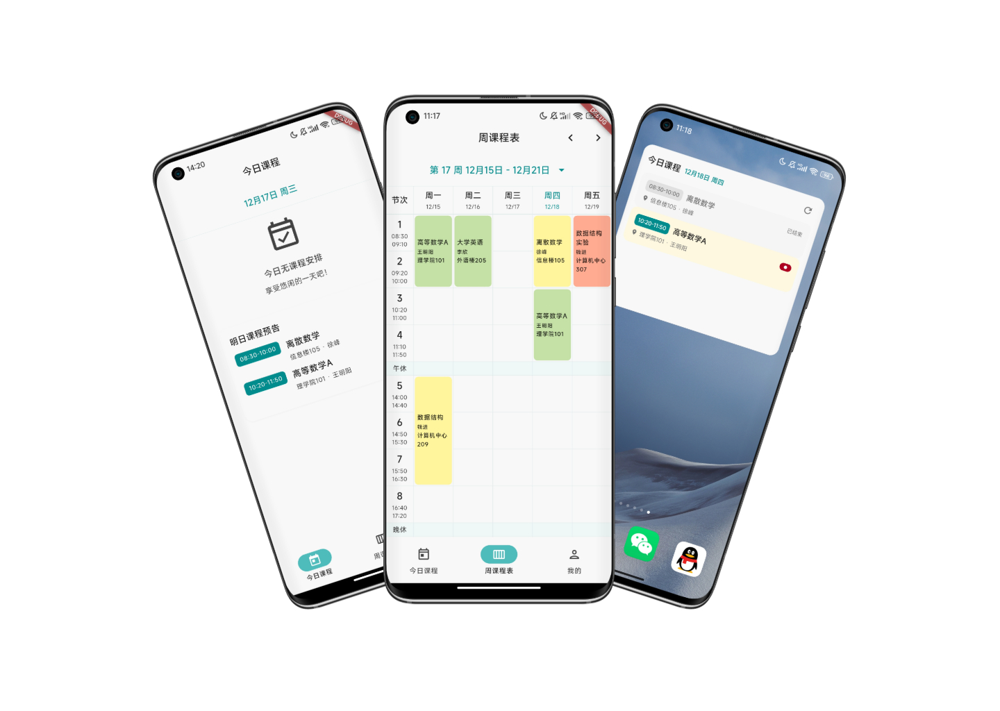

  SchedU
  

SchedU是一个Flutter编写的多平台课程表，采用Material 3风格设计，支持从教务系统导入课程。

### 下载及安装
点击下方链接前往发布页下载安装包，可根据你的手机系统及CPU架构选择对应的安装包：
- 系统：暂时仅提供Android安装包
- CPU架构：
  - arm64-v8a（适用于大多数现代Android设备）
  - armeabi-v7a（适用于部分老旧Android设备）
  - x86_64（适用于部分模拟器和特殊设备）

**[安装包下载](../../releases)**

### 目录
- **[效果图](#效果图)**
- **[功能列表](#功能列表)**
- **[关于AI导入功能](#关于ai导入功能)**
- **[架构概览](#架构概览)**
- **[导入导出](#导入导出)**
- **[本地化](#本地化)**
- **[FlutterWebView 实现说明](#flutterwebview-实现说明)**
- **[特别鸣谢](#特别鸣谢)**
- **[许可证](#许可证)**

## 效果图
详见[效果图](photos/README.md)

## 功能列表：
* 今日课程
* 明日课程预告
* 周课程表
* 支持冲突课程
* 课程管理
* 日课程小组件
* 周课程小组件 **（开发中）**
* JSON格式的课程导入/导出
* 从教务系统导入课程（AI模式和JavaScript模式）
* 基于OCR+AI的图片导入课程 **（开发中）**
* 主题切换（浅色/深色/系统）

## 关于AI导入功能

#### 说明
SchedU集成了[openai_dart](https://pub.dev/packages/openai_dart)，支持调用兼容OpenAI标准的API导入课程，可以在APP设置中配置API Key和API地址。
**本APP附带有免费AI服务，免费API服务仅供体验，有并发和使用次数限制，请合理使用。（免费AI服务使用多个平台的国产模型，由系统随机分配）**

**注意：使用AI导入功能会把导入时打开的页面HTML内容发送到第三方AI服务进行解析，请确保你信任所使用的AI服务提供商，并了解相关的隐私政策。本项目上传HTML只供临时解析使用，不会进行保存。**

（暂未对IOS的WKWebView进行适配；后续的Web版本不会对教务导入进行适配）

#### AI导入逻辑
1. 通过内置浏览器(WebView)打开学校教务系统，登录后进入课程表页面。
2. 在点击 “解析导入” 按钮后，获取当前页面的HTML内容。
3. 将HTML内容在本地执行JavaScript进行初步清洗，提取课程相关的HTML片段。(具体见[schedule_parse.js](assets/schedule_parse.js))
4. 将清洗后的HTML片段发送到AI服务进行智能解析，获取结构化的课程数据。
5. 将解析得到的课程数据保存到本地数据库，并更新课程表显示。

## 架构概览
- **界面层** (`lib/view/`)：按功能组织的屏幕部件（日课程、周课程、我的、教务导入）
- **状态管理** (`lib/bloc/`)：使用BLoC模式进行状态管理，包含独立的事件/状态/Bloc文件
- **服务层** (`lib/service/`)：AI聊天、课程导入、OpenAI集成等业务逻辑的实现
- **仓库层** (`lib/repository/`)：数据访问抽象（课程使用SQLite，设置使用SharedPreferences）
- **模型层** (`lib/model/`)：使用json_serializable进行JSON序列化的数据类

## 导入导出
详见[导入导出文档](IMPORT_FORMAT.md)

## 本地化
- 硬编码为中文（zh_CN）
- 设置了支持中文的 Material 本地化代理
- 所有界面文本均使用中文

(ps: 因为我觉得Flutter的国际化支持不太好用，而且我只打算做中文版，所以就不做国际化的支持了)

---

## FlutterWebView 实现说明

详见[FlutterWebView 实现说明](FLUTTER_WEBVIEW.md)

## 特别鸣谢
感谢提供大模型服务免费使用或试用的平台：
- [魔塔社区](https://modelscope.cn/)
- [智普AI开放平台](https://open.bigmodel.cn/)
- [阿里云](https://www.aliyun.com/)
- [火山引擎](https://www.volcengine.com/)
- [腾讯云](https://cloud.tencent.com/)
- [小米Mimo](https://platform.xiaomimimo.com/)

**感谢以下开源项目和库：**
[flutter_bloc](https://pub.dev/packages/flutter_bloc)、
[dio](https://pub.dev/packages/dio)、
[json_annotation](https://pub.dev/packages/json_annotation)、
[flutter_svg](https://pub.dev/packages/flutter_svg)、
[sqflite](https://pub.dev/packages/sqflite)、
[shared_preferences](https://pub.dev/packages/shared_preferences)、
[equatable](https://pub.dev/packages/equatable)、
[path](https://pub.dev/packages/path)、
[cupertino_icons](https://pub.dev/packages/cupertino_icons)、
[file_picker](https://pub.dev/packages/file_picker)、
[openai_dart](https://pub.dev/packages/openai_dart)、
[build_runner](https://pub.dev/packages/build_runner)、
[json_serializable](https://pub.dev/packages/json_serializable)、
[flutter_gen_runner](https://pub.dev/packages/flutter_gen_runner)、
[gson](https://github.com/google/gson)、
[package_info_plus](https://pub.dev/packages/package_info_plus)

# 许可证
本项目采用 MIT 许可证，详见 [LICENSE](LICENSE)

Copyright (c) 2025 gnahz77
